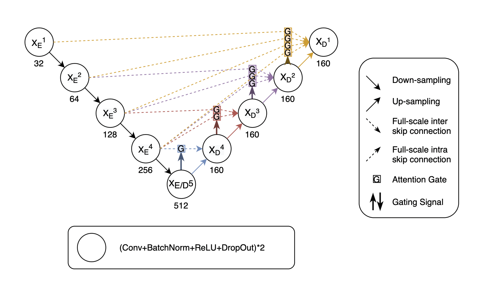

# MyPaper
A rough draft of my graduation paper of National Taipei University of Education.

Using attention-unet is good enough for HC measurement. I just want to make my graduate paper looks novel, so I try a lot of method but no obvious effect.

